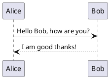
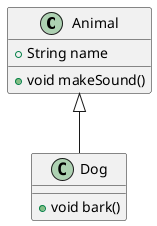
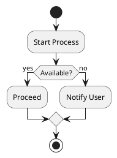

# PlantUML

텍스트 기반 UML 다이어그램 생성 도구

## 지원 다이어그램

| 유형 | 용도 |
|------|------|
| 시퀀스 | 객체 간 상호작용 |
| 클래스 | 클래스 관계 |
| 활동 | 프로세스 흐름 |
| 컴포넌트 | 시스템 구성 |

---

## 설치 (Windows)

### 1. 필수 프로그램 설치
- [Java](https://www.java.com/ko/download/)
- [Graphviz](https://plantuml.com/ko/graphviz-dot)
- [plantuml.jar](https://plantuml.com/ko/download) → 특정 경로에 저장

### 2. 환경변수 설정

**사용자 변수:**
```
JAVA_JRE_HOME = C:\Program Files\Java\jre1.8.0_421
```

**시스템 Path:**
```
C:\Program Files\Graphviz\bin
%JAVA_JRE_HOME%\bin
```

### 3. VSCode 설정
1. **PlantUML by jebbs** 익스텐션 설치
2. 설정에서 `plantuml.jar` 경로 입력

---

## 사용

1. `.puml` 파일 생성
2. 코드 작성
3. `Alt + D`로 미리보기

---

## 예시

### 시퀀스 다이어그램




### 클래스 다이어그램




### 활동 다이어그램




---

## 마크다운 삽입

```markdown

```

- `src=` 뒤에 GitHub Raw URL 사용
- `cache=no`로 최신 버전 렌더링

> **주의**: Public 저장소에서만 사용 가능. Private 저장소는 CI로 이미지 생성 권장.
